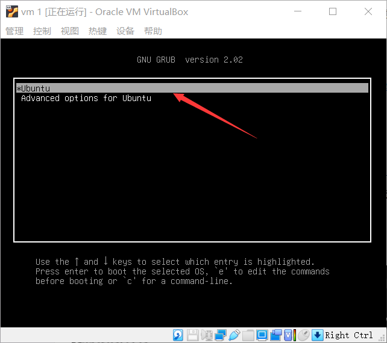
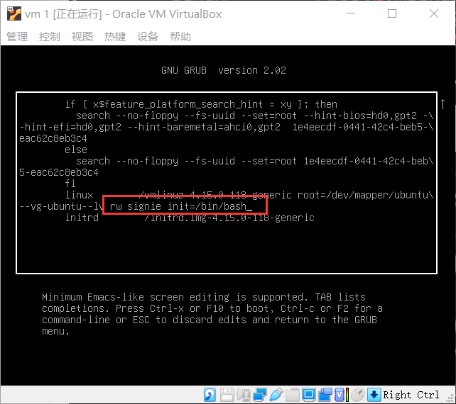
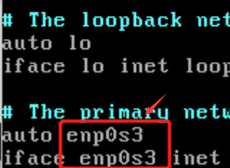
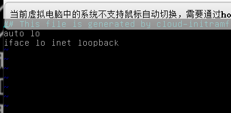
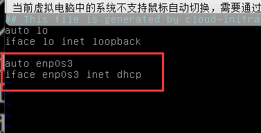

在搭建vulnhub靶场的时候，虚拟机网络配置正确的情况下还是扫描不到 IP ，故在网上找到了靶机账户密码，登陆上去一探究竟，结果就没获取到ip,甚至网卡都莫得。

后来在多次重启以及查询相关资料过后，发现时靶机启动时加载网卡的时候出现了问题。

(忘记截图了)，就是在靶机启动的时候加载内核驱动的那时候，加载网络配置的一条错误信息。

靶机时 ubuntu 系统。

在网上找到的只有普通账户权限，无法修改网络相关配置，故需进入拯救模式来获取 root 权限进行修改。

修改方法：

重启靶机，按住 `shift` 键不放就会出现以下界面。



出现之后就松开 `shift` ,在继续按下 `e`,


找到方框中linux 后内容，(因为屏幕小，放的字符有限，所以还可以往下移动)


找到 `linux` 开头，再找到 `ro` ,将 `ro` 修改为 `rw signie init=/bin/bash` ,注意同时需要把 ` ro` 后边的内容给删除，要不然进入 bash 时会出错，修改后效果如图：



 修改之后，按 `ctrl + x` 即可进入 bash.而且是 root 权限。

现在就可以排除具体原因了。

```
ip a
```


可以看到，网卡 `enp0s3` 没有获取到 ip ,

那么再来看看网卡配置文件

本来昨晚一台靶机正常操作是这样：

```
vim /etc/network/interfaces
```

配置网卡与实际网卡名称不符，所以把名称改过来就可以了。



然后重启从网络

```
/etc/init.d/networking restart
```

之后 ip 就有了，

但是修改另一台靶机的时候，好家伙`/etc/network/interfaces` 里啥都没有

`/etc/init.d/networking` 命令也没有。




